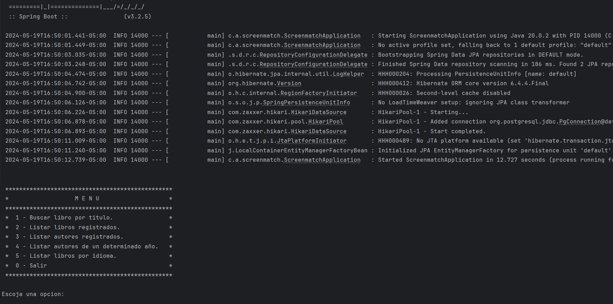

## Libreria Alura con Gutendex-api

Busca libros en la pagina web para rigistrar los datos en la Base de Datos del proyecto.

---

## Uso
1) Asegurece de que la clave, usuario, ip y nombre de la BD sean iguales para poder trabajar.
2) Al ejecutar el programa tendra 6 opciones para escoger.
3) Dependiendo de la opcion escogida el programa actuara segun corresponda.
4) Por ultimo, si quiere salir solo debe escoger la ultima opcion del menu.

## Nota
Para una mejor visualisacion previa puede consultarlo con la imagen.

